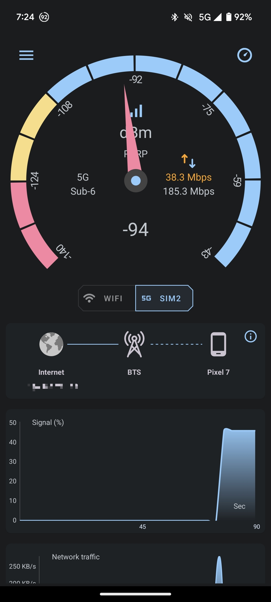
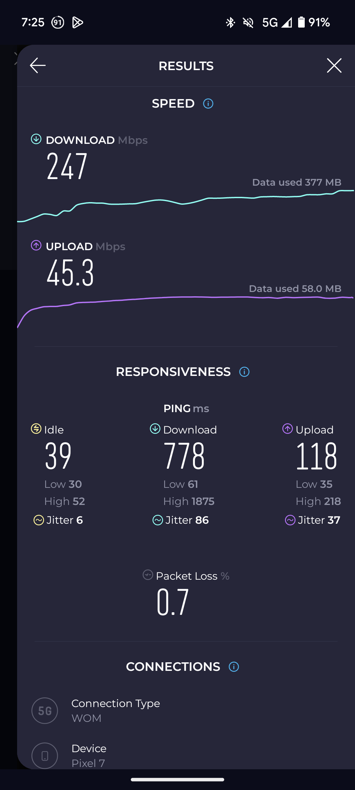

# Pixel 7 & 7Pro 5G/VoLTE Module

Since Google disables 5G on phones in "unsupported countries" This module aims to enable 5G capabilities and VoLTE on your Pixel 7 & 7 Pro

Currently tested on my: Pixel 7

## You need to have ROOT on your phone first
Just download the zip from the releases webpage and install it on Magisk/KernelSU

Enjoy!

## Screenshots

Credits:
[foobar66](https://xdaforums.com/t/mod-magisk-root-volte-enabler.4372705/) for his first module for Pixel 6

